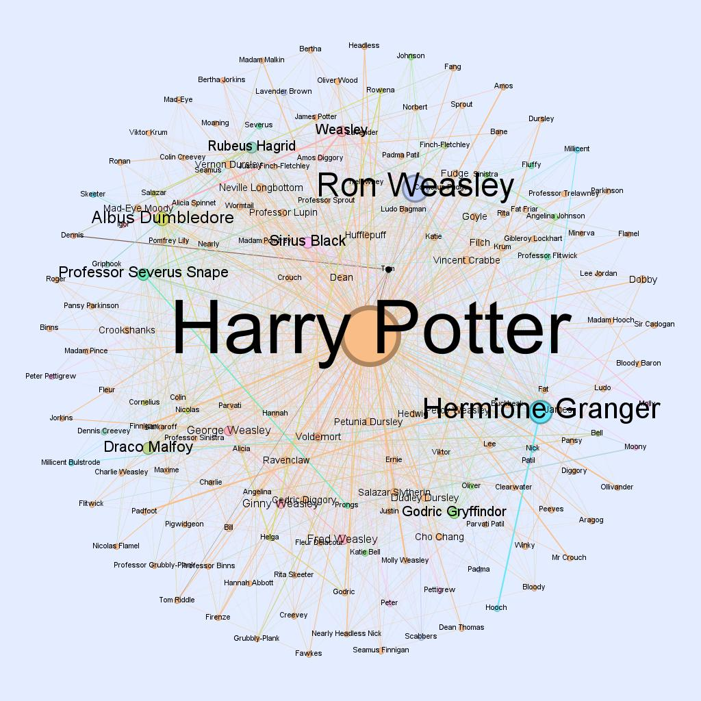

# 大数据综合处理大实验

## wordcount
最基础的统计单词出现次数

## invertedindex

1. 文档倒排索引，统计每一个单词，
2. 平均出现次数进行全局排序
3. 统计TF-IDF

## KNN

使用Hadoop实现简单的数据挖掘算法。

KNN算法：对每一个测试点计算其到每一个训练样本点的距离，其中最小的K个训练样本点对测试点所属类别进行估计。算法对这K个点根据距离加权（使用高斯函数加权）求和取最大值。

## relationship

使用Hadoop技术对《哈利·波特》原文小说进行人物关系的分析
### 子任务
本项目可分为五个子任务：
1. 数据预处理，从英文版哈利波特系列小说的文本中，抽取出与人物互动相关的数据，从而屏蔽掉与人物关系无关的文本内容，为后面基于人物同现的分析做准备。此任务中已有人名列表，采用**Trie** 提取人名。
2. 特征抽取，完成基于单词同现算法的人物同现统计，在人物同现分析中，如果两个人在原文的同一段落中出现，则认为两个人发生了一次同现关系。
3. 特征处理，根据共现关系生成人物之间的关系图，使用邻接表的形式表示，方便后面的PageRank计算，两个人的密切程度根据边的权重来体现。
4. 数据分析，根据人物关系图进行 **PageRank** 值的计算，从而定量地分析出哈利波特系列小说的角色占剧情中的分量如何。
5. 数据分析，根据人物关系图进行**标签传播算法**分析，为图上的顶点打标签，进行图顶点的聚类分析，从而在一张类似社交网络图中完成社区发现。

### 实验结果

